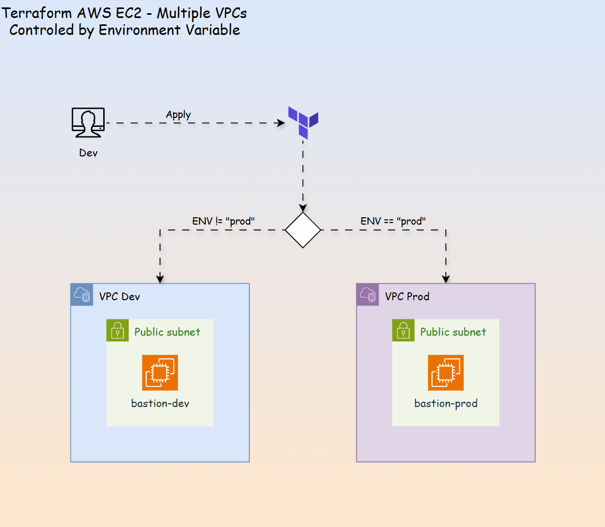

# Terraform AWS EC2 Template - Control VPC Provision by ENV

- [Terraform AWS EC2 Template - Control VPC Provision by ENV](#terraform-aws-ec2-template---control-vpc-provision-by-env)
  - [Diagram](#diagram)
  - [Initialize](#initialize)
  - [Control VPC](#control-vpc)

---

## Diagram



---

## Initialize

```sh
# initialize with remote backend
terraform init -backend-config=state.config
```

---

## Control VPC

- By default, Provision VPC in prod

```terraform
variable "ENV" {
  default = "prod"
}


resource "aws_instance" "bastion_host" {
  # ...
  # if the ENV is prod, then use vpc-prod; Otherwise, vpc-dev
  subnet_id                   = var.ENV == "prod" ? module.vpc-prod.public_subnets[0] : module.vpc-dev.public_subnets[0]
  vpc_security_group_ids      = [
      var.ENV == "prod" ? aws_security_group.bastion_sg_prod.id : aws_security_group.bastion_sg_dev.id
    ]

  # ...
}
```

- Use `-var` to provision VPC in dev

```sh
# apply dev
terraform apply -var ENV=dev
```
